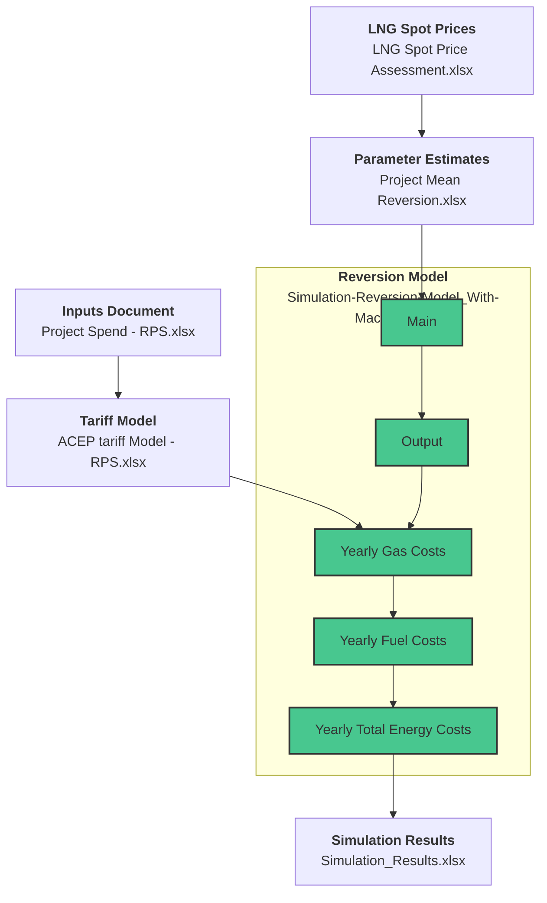

---

## Workbooks

LNG Spot Prices
------

 Workbook Description 

-Collects various sources for natural gas spot prices
-Runs regression to fill in gaps in data
-Produces LNG price data for each month of a 10-year period

 

Parameter Estimates
------

 Workbook Description 

-Uses LNG regression data
-Estimates relevant parameters and volatilities for mean reversion model

 

Inputs Document
------

 Workbook Description 

-Breaks new renewable energy infrastructure purchases into 23 separate projects (9 solar, 14 wind) which begin development, construction, and production in different years.
-Allows users to change model parameters, cost/schedule inputs, assumptions about technological advancements and region-specific factors.
-Indexes various schedule information to be easily used by Tariff Model.

 

Tariff Model
------

 Workbook Description 

-Calculates various metrics for each project including but not limited to subsidies, CapEx, AFUDC, Book Depreciation, Tax Depreciation, ADIT, Traditional Cost of Service, and Levelized Cost of Service
-Uses yearly expenditures of each project to find yearly expenditures of all projects, which are then used to find the “Yearly Total Energy Costs” for the RPS plan.

 

Reversion Model
------
This is the project's main model. It includes several sheets which build ontop of one another to produce final results.

 Main 

    
**Process:** Uses user inputs (e.g. from Parameter Estimates) to generate a sample price path with monthly data  
**Result:** Generates new sample path each time sheet is refreshed

 

 Output 

    
**Process:** Uses a VBA Macro to record 1000 sample price paths generated from “Main” sheet.
**Result:** Monthly LNG prices - 1000 rows

 

 Yearly Gas Costs 

    
**Process:**  
Averages the monthly data for each year of the simulation using a VBA macro.  

**Result:**  
Yearly LNG prices - 1000 rows

 

 Yearly Fuel Costs 

    
**Process:**  
Adds yearly predicted coal and oil prices (from NREL data) to yearly LNG prices. Does this for both RPS and BAU cases. Uses inflation assumptions to calculate both nominal costs and real costs.  

**Result:**
- Yearly Fuel prices under RPS plan (nominal & real) - 1000 rows (each)
- Yearly Fuel Prices under BAU plan (nominal & real) - 1000 rows (each)

 

 Yearly Total Energy Costs 

    
**Process:**  
Adds yearly predicted fuel costs to yearly predicted non-fuel costs. Most predicted non-fuel costs are taken from NREL data. “Renewable Purchases” for the BAU case are taken from NREL data, but the RPS data were calculated by Tariff Model. Non-variable Generation Costs were calculated separately, as the NREL data only accounted for variable costs. Yearly energy usage data was used to calculate the yearly cost to consumers.  

**Result:**
- Yearly Total Energy Cost (nominal) for RPS & BAU Plan - 1000 rows (each)
- Yearly Price Per KWh for RPS & BAU Plan - 1000 rows (each)
- Yearly Cost to Consumers for RPS & BAU Plan - 1000 rows (each)

 

Simulation Results
------

 Workbook Description 

    
**Process:**  
A VBA macro copies description information from Reversion Model and Inputs Document, as well as data from “Yearly Total Energy Costs.” It copies values only, so that once they are produced, these results can be analyzed without needing a connection to the other documents.  

**Result:**
- “Runs Summary” sheet for both BAU & RPS case with a table of Yearly Fuel Costs, Energy Costs, Price Per kWH, and Cost to Consumers
- Multiple sheets of analysis and graphs

 

## VBA Macros

