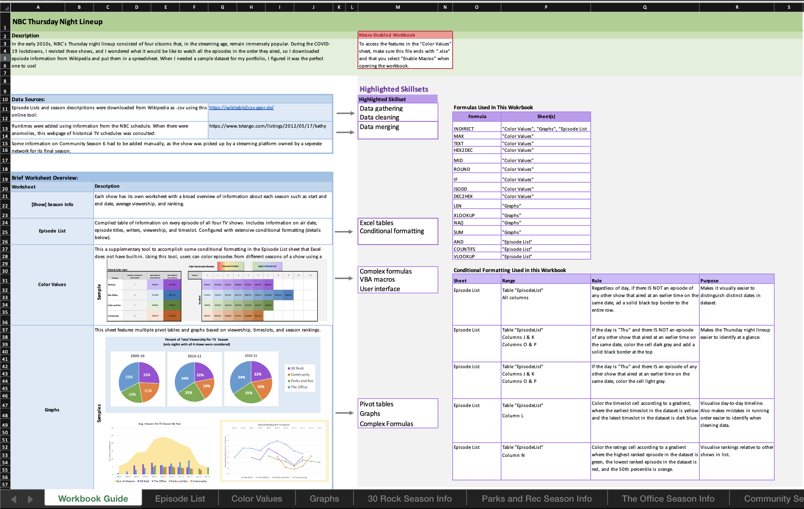
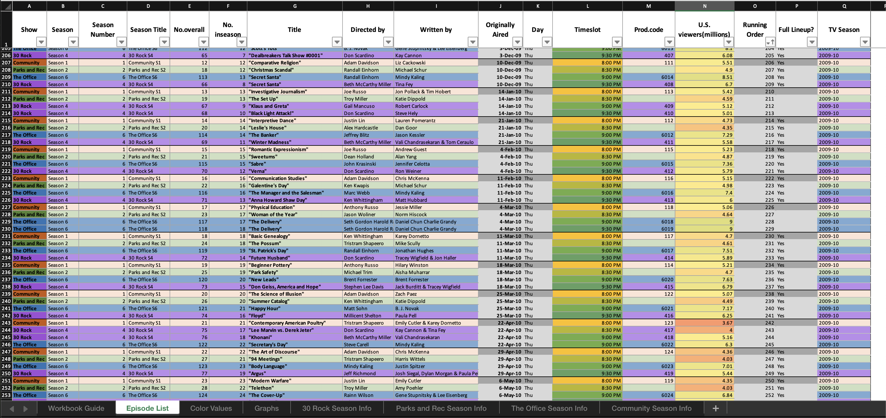
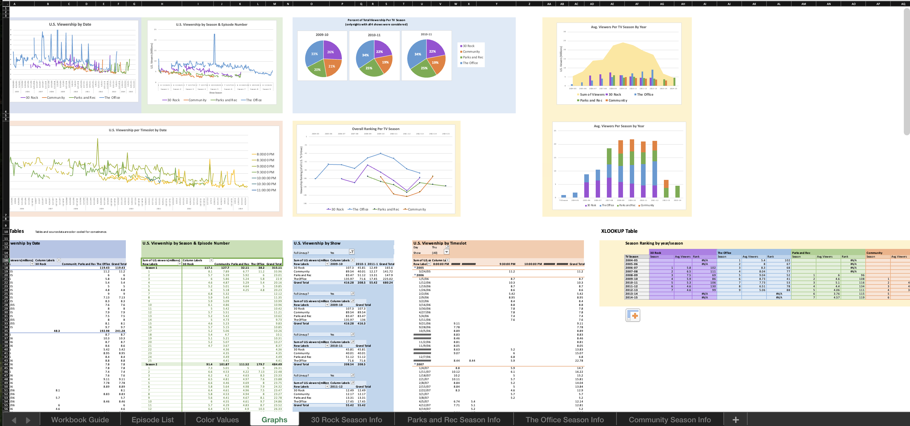

# Microsoft Excel

**Project description:**  
This project is a collection of data from four NBC TV shows: The office, 30 Rock, Community, and Parks and Recreation.  

**Download the workbook here:**  

 
   

>  [!IMPORTANT]
>  If given the option, ensure it is a macro-enabled file (.xlsm). Click "Enable Macros" when prompted after opening. You can also browse the screenshots or video (coming soon) below.

Workbook Guide:
======

Introduction Page
------

 Full Page Screenshot 

> This sheet gives users an overview of the workbook as a whole. It also functions as an index for skills utilized and formula types.

---

Episode List
------

 Full Page Screenshot 

> This sheet features a table of every episode of each show. The table can be filtered and sorted by different metrics. Some cells utilize conditional formatting to quickly identify information about air time, ratings, and schedule. All other cells are colors based on the show and season– these colors can be specified using the "Color Values" tool.

---

Graphs
------

 Full Page Screenshot 

> This sheet utilizes pivot tables and lookup tables to graph various metrics. A future goal of this project is automatically matching the colors of TV shows in the legend with the colors specified in the "Color Values" tool.

---

Color Values
------

**Technical Details:** [Click Here](/excel-nbc-colorvalues.md) to explore the technical details of the Color Value Tool

 Full Page Screenshot

  

> This tool gives users control over the colors used to identify shows & seasons in "Episode List". A future goal of this project is to connect this tool to the "Graphs" sheet, as well. Please note that this tool will only work in a macro-enabled workbook (see instructions at top of page for more details).

---

Season Info
------

 Sample Page Screenshot

  

> Each show has its own sheet titled "[Show Name] Season Info". These data came from .csv files scraped from Wikipedia tables. Some data had to be cleaned and formatted for consistency.

